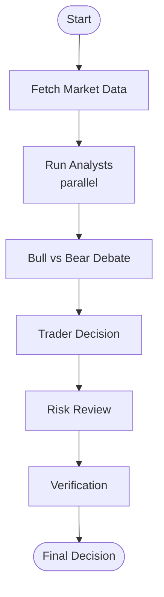

# Documentation

## Contents

| Document | Description |
|----------|-------------|
| [Architecture](architecture.md) | System design, agent pipeline, state management, Mermaid diagrams |
| [Usage Guide](usage.md) | Installation, Streamlit dashboard, CLI, data sources, troubleshooting |
| [Configuration](configuration.md) | All environment variables, recommended settings per use case |

## Architecture at a Glance



**9 Agents:** Fundamental Analyst, Sentiment Analyst, News Analyst, Technical Analyst, Bull Researcher, Bear Researcher, Trader, Risk Manager, Verifier

**4 Free Data Sources:** Yahoo Finance, Google News, SEC EDGAR, Google Trends

**3 LLM Providers:** Ollama (local), LM Studio (local), OpenAI (cloud)

**2 Interfaces:** Streamlit visual dashboard, Rich CLI

See [Architecture](architecture.md) for full details with data flow diagrams.

## Quick Start

```bash
cd opentrade-ai
python -m venv venv && source venv/bin/activate
pip install -e ".[dev]"
cp .env.example .env

# Streamlit
python -m streamlit run app/streamlit_app.py

# CLI
python -m cli.main -t AAPL -p lmstudio
```

See [Usage Guide](usage.md) for detailed setup instructions.
