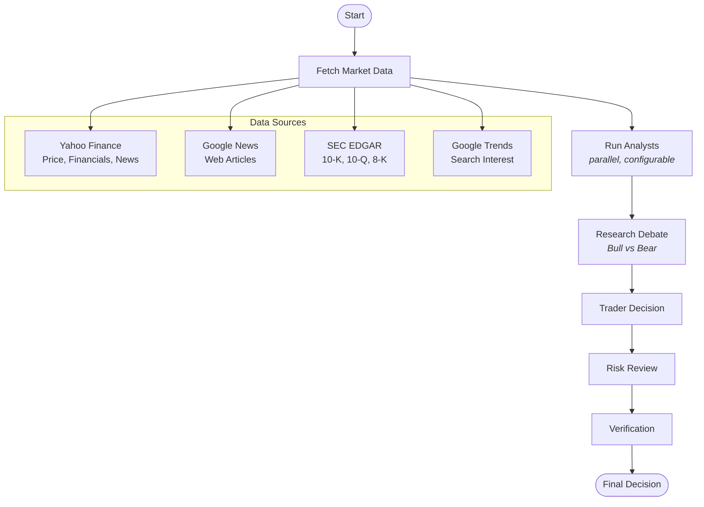
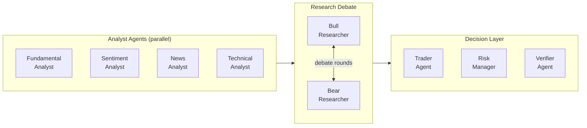
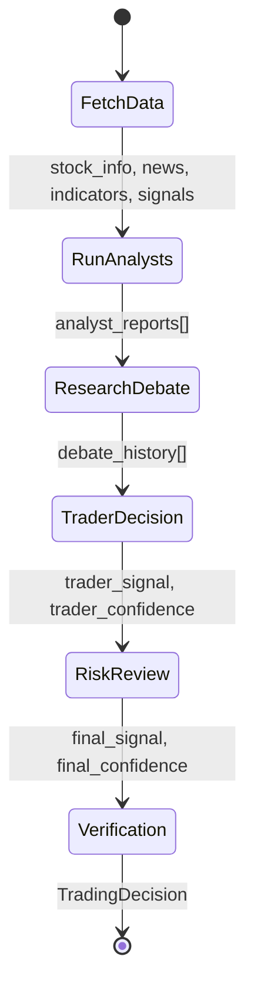
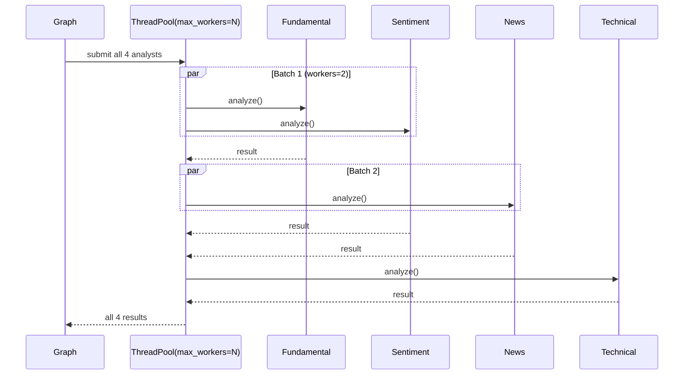
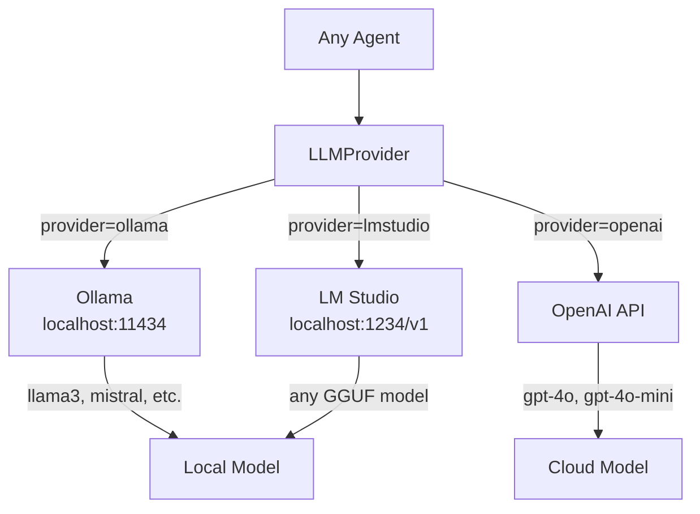
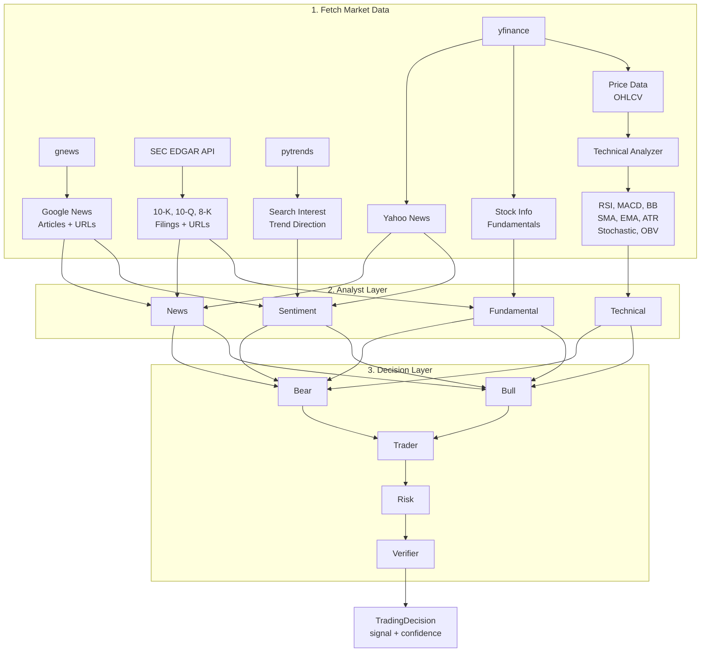

# Architecture

## System Overview

OpenTrade.ai is a multi-agent stock analysis system orchestrated via LangGraph. Nine specialized AI agents collaborate through a directed acyclic graph (DAG) to produce a final trading recommendation with confidence scoring and risk management.

## High-Level Pipeline



## Agent Architecture



## State Management

The system uses LangGraph's `StateGraph` with a `TypedDict` state object. State flows through each node, accumulating analysis results.



### State Fields

| Field | Type | Description |
|-------|------|-------------|
| `ticker` | `str` | Stock ticker symbol |
| `date` | `str \| None` | Analysis date |
| `stock_info` | `dict` | Company fundamentals from Yahoo Finance |
| `news` | `list` | Yahoo Finance news articles |
| `google_news` | `list` | Google News articles |
| `sec_filings` | `list` | SEC EDGAR filings |
| `google_trends` | `dict` | Google Trends interest data |
| `price_data` | `DataFrame` | Historical OHLCV price data |
| `indicators` | `dict` | Computed technical indicators |
| `signals` | `dict` | Technical signal summary |
| `analyst_reports` | `list[AnalysisResult]` | All analyst outputs |
| `debate_history` | `list[dict]` | Bull/Bear debate rounds |
| `trader_summary` | `str` | Trader's analysis |
| `risk_assessment` | `str` | Risk manager's review |
| `final_signal` | `str` | Final recommendation |
| `final_confidence` | `float` | Confidence percentage |

## Agent Details

### 1. Fundamental Analyst

Evaluates company financials, valuation metrics, and growth trajectory. Consumes `stock_info`, `indicators`, `signals`, and `sec_filings`.

### 2. Sentiment Analyst

Analyzes market sentiment from news coverage and social signals. Consumes `stock_info`, `news`, `google_news`, and `google_trends`.

### 3. News Analyst

Processes recent news for trading-relevant implications, catalysts, and risks. Consumes `stock_info`, `news`, `google_news`, and `sec_filings`.

### 4. Technical Analyst

Interprets quantitative indicators (RSI, MACD, Bollinger Bands, moving averages, etc.). Consumes `indicators` and `signals`.

### 5. Bull Researcher

Builds the strongest possible bullish case using all analyst reports. Engages in multi-round debate with the Bear Researcher.

### 6. Bear Researcher

Builds the strongest possible bearish case. Counter-argues the Bull Researcher across debate rounds.

### 7. Trader Agent

Synthesizes all analyst reports, debate outcomes, and risk tolerance into a final trading decision with signal and confidence.

### 8. Risk Manager

Reviews the trader's decision against risk parameters. Can approve, modify (reduce confidence), or reject (force hold) the trade.

### 9. Verifier Agent

Quality gate that checks for contradictions, unsupported claims, and internal consistency across all analysis outputs.

## Parallel Execution

Analyst agents run in parallel using `ThreadPoolExecutor`. The number of concurrent agents is configurable via `MAX_PARALLEL_AGENTS` (default: 2).



## LLM Integration



All LLM calls include retry logic (3 attempts, 2-second delay) to handle transient failures common with local LLMs.

## Data Flow



## Module Structure

```
src/opentrade_ai/
    agents/
        base.py                  # BaseAgent, AnalysisResult, AgentRole
        fundamental_analyst.py   # Company financials analysis
        sentiment_analyst.py     # Market sentiment analysis
        news_analyst.py          # News impact analysis
        technical_analyst.py     # Technical indicators analysis
        bull_researcher.py       # Bullish case builder
        bear_researcher.py       # Bearish case builder
        trader.py                # Trading decision maker
        risk_manager.py          # Risk assessment
        verifier.py              # Quality verification
    analysis/
        technical_indicators.py  # RSI, MACD, BB, SMA, EMA, ATR, etc.
    data/
        market_data.py           # Unified data provider
        google_news.py           # Google News integration
        sec_edgar.py             # SEC EDGAR API client
        google_trends.py         # Google Trends integration
    graph/
        trading_graph.py         # LangGraph StateGraph orchestration
    llm/
        provider.py              # Multi-provider LLM client
    config.py                    # Configuration management
    report.py                    # JSON/HTML report export
    screener.py                  # Multi-ticker screener
```
